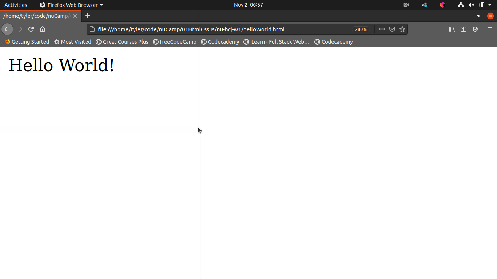
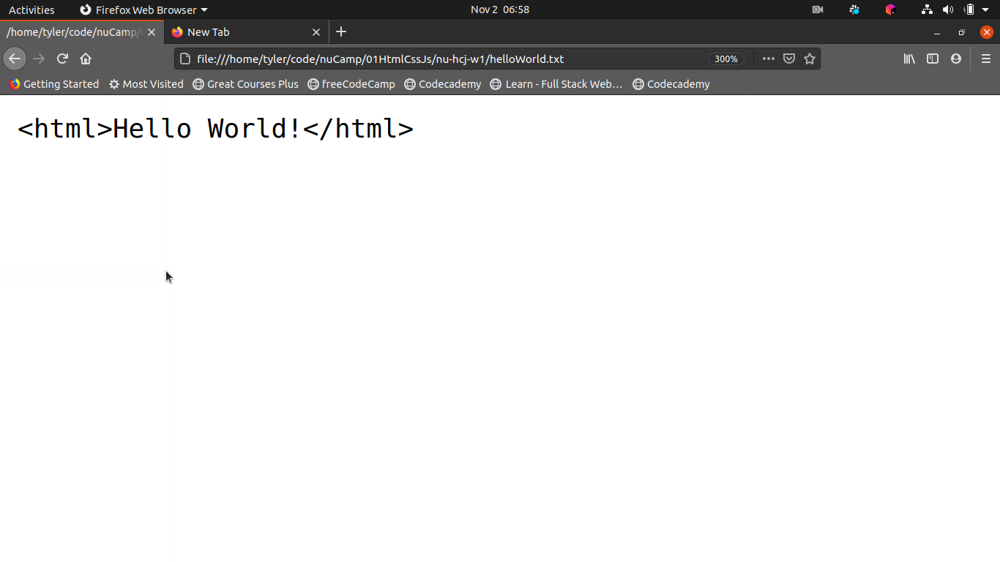

# nu-hcj-w1

This is the empty repo for week 1 of HTML, CSS and JavaScript. You can change to each exercise by changing the branch on the bottom left corner of the screen.

## Exercise: HTML Hello World

- Use the force (i.e. the command line), Luke! 

```bash

$ touch helloWorld.html
$ touch helloWorld.txt

```

- This is our `hello world` code:

```html
<html>Hello World!</html>
```
- [`helloWorld.html`](helloWorld.html) in the browser:



- [`helloWorld.txt`](helloWorld.txt) in the browser:

